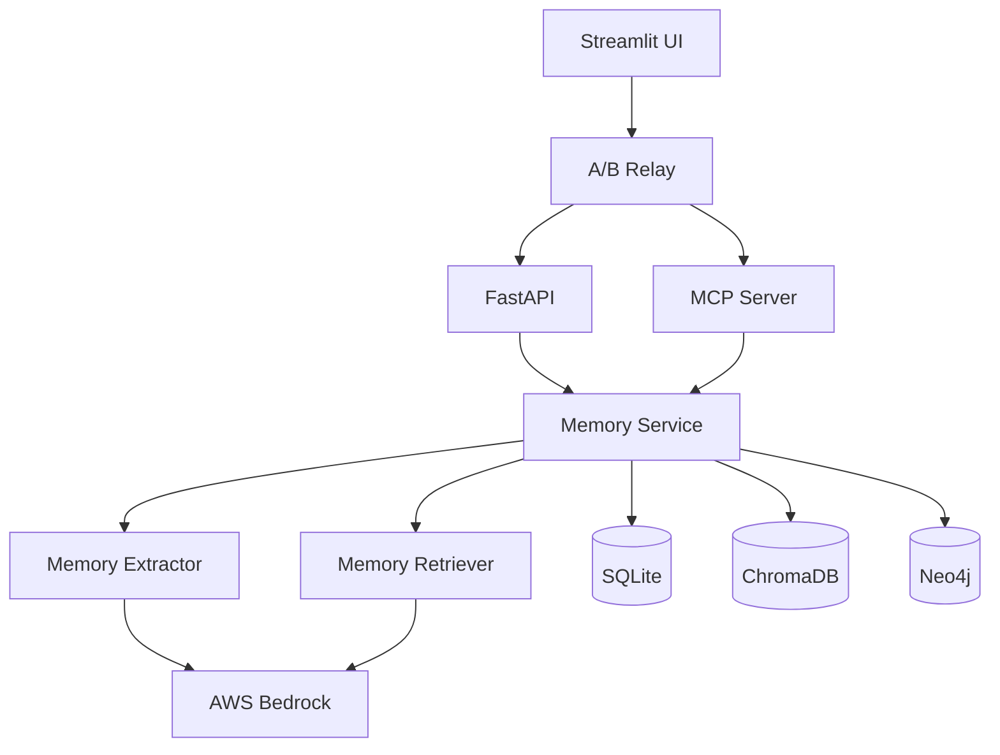

# MemoryGraph: System Design Document

## Executive Summary

MemoryGraph is an advanced AI system that provides persistent memory capabilities to Large Language Models (LLMs), enabling them to learn, remember, and reason about information across multiple interactions. This document outlines the complete system design, including architecture, data models, algorithms, and implementation strategies.

## Table of Contents
1. [System Overview](#system-overview)
2. [Design Principles](#design-principles)
3. [System Architecture](#system-architecture)
4. [Data Models](#data-models)
5. [Algorithms and Processing](#algorithms-and-processing)
6. [Storage Design](#storage-design)
7. [API Design](#api-design)
8. [Security and Privacy](#security-and-privacy)
9. [Scalability and Performance](#scalability-and-performance)
10. [Monitoring and Observability](#monitoring-and-observability)
11. [Deployment Strategy](#deployment-strategy)

## System Overview

### Problem Statement
Traditional LLMs lack persistent memory, requiring users to provide context in every interaction. This leads to:
- Repetitive information sharing
- Loss of conversation history
- Inability to build on previous interactions
- Poor user experience for complex, multi-session tasks

### Solution
MemoryGraph provides a comprehensive memory system that:
- Stores and retrieves information across sessions
- Maintains multiple types of memory (factual, episodic, graph-based)
- Enables transparent reasoning and explanation
- Provides user control over memory management

### Key Features
- **Persistent Memory**: Information persists across sessions
- **Multi-Modal Storage**: Facts, episodes, and graph relationships
- **Transparent Reasoning**: AI shows how it reaches conclusions
- **Selective Forgetting**: Users control what AI remembers
- **Real-Time Learning**: AI learns from new interactions immediately
- **A/B Testing**: Compare memory vs no-memory performance

## Design Principles

### 1. Modularity
- Clear separation of concerns
- Independent, testable components
- Loose coupling between modules

### 2. Scalability
- Horizontal scaling capability
- Efficient resource utilization
- Performance optimization

### 3. Reliability
- Fault tolerance
- Error handling and recovery
- Data consistency

### 4. Transparency
- Explainable AI decisions
- Audit trails
- User control over data

### 5. Privacy
- Data isolation by user
- Selective forgetting
- Source attribution

## System Architecture

### High-Level Architecture

```
┌─────────────────────────────────────────────────────────────────┐
│                        User Interface Layer                     │
├─────────────────────────────────────────────────────────────────┤
│  Streamlit UI  │  A/B Relay  │  MCP Server  │  REST API        │
├─────────────────────────────────────────────────────────────────┤
│                        Application Layer                        │
├─────────────────────────────────────────────────────────────────┤
│  Memory Service  │  Memory Extractor  │  Memory Retriever      │
├─────────────────────────────────────────────────────────────────┤
│                        Storage Layer                            │
├─────────────────────────────────────────────────────────────────┤
│  SQLite (Facts)  │  ChromaDB (Episodes)  │  Neo4j (Graph)      │
├─────────────────────────────────────────────────────────────────┤
│                        Infrastructure Layer                     │
├─────────────────────────────────────────────────────────────────┤
│  AWS Bedrock  │  Docker  │  Monitoring  │  Logging             │
└─────────────────────────────────────────────────────────────────┘
```

### Component Interactions



## Data Models

### 1. Factual Memory Model

```python
class Fact:
    guid: str          # User identifier
    key: str           # Fact key
    value: str         # Fact value
    confidence: float  # Confidence score (0.0-1.0)
    source: str        # Source channel
    ts: str           # Timestamp
    created_at: datetime
    updated_at: datetime
```

**Characteristics:**
- Key-value structure
- Confidence scoring
- Source attribution
- Temporal tracking

### 2. Episodic Memory Model

```python
class Episode:
    id: str                    # Unique identifier
    guid: str                  # User identifier
    text: str                  # Episode text
    embedding: List[float]     # Vector embedding
    metadata: Dict[str, Any]   # Additional metadata
    importance: float          # Importance score
    tags: List[str]           # Episode tags
    created_at: datetime
```

**Characteristics:**
- Vector-based storage
- Semantic similarity search
- Metadata enrichment
- Importance scoring

### 3. Graph Memory Model

```python
class Entity:
    name: str                  # Entity name
    type: str                  # Entity type
    aliases: List[str]         # Alternative names
    properties: Dict[str, Any] # Additional properties
    created_at: datetime
    updated_at: datetime

class Relationship:
    subject: str               # Source entity
    predicate: str             # Relationship type
    object: str                # Target entity
    confidence: float          # Relationship confidence
    properties: Dict[str, Any] # Additional properties
    created_at: datetime
```

**Characteristics:**
- Graph-based structure
- Relationship modeling
- Path finding capabilities
- Constraint enforcement

## Algorithms and Processing

### 1. Information Extraction Algorithm

```python
def extract_information(text: str, channel: str, timestamp: str) -> Dict:
    """
    Extract structured information from text using Claude.
    
    Steps:
    1. Send text to Claude with extraction prompts
    2. Parse JSON response
    3. Filter by confidence threshold
    4. Validate entity types and predicates
    5. Return structured data
    """
    
    # Extract facts and episodes
    structured = extract_structured(text, channel, timestamp)
    
    # Extract entities and triples
    triples = extract_triples(text, channel, timestamp)
    
    # Merge and validate
    return merge_extractions(structured, triples)
```

### 2. Memory Scoring Algorithm

```python
def calculate_memory_score(similarity: float, recency: float, 
                          importance: float, graph_proximity: float) -> float:
    """
    Calculate weighted memory score.
    
    Formula:
    score = 0.55 * similarity + 0.2 * recency + 0.15 * importance + 0.1 * graph_proximity
    """
    
    return (0.55 * similarity + 
            0.2 * recency + 
            0.15 * importance + 
            0.1 * graph_proximity)
```

### 3. Graph Path Finding Algorithm

```python
def find_shortest_paths(user_guid: str, topic: str, max_depth: int = 3) -> List[Path]:
    """
    Find shortest paths from user to topic in knowledge graph.
    
    Algorithm:
    1. Start from user node
    2. Traverse graph using BFS
    3. Stop at max_depth or when topic found
    4. Return all valid paths
    """
    
    paths = []
    queue = [(user_guid, [user_guid])]
    visited = set()
    
    while queue and len(paths) < max_paths:
        current, path = queue.pop(0)
        
        if current in visited:
            continue
            
        visited.add(current)
        
        if current == topic:
            paths.append(Path(path))
            continue
            
        if len(path) < max_depth:
            neighbors = get_neighbors(current)
            for neighbor in neighbors:
                queue.append((neighbor, path + [neighbor]))
    
    return paths
```

## Storage Design

### 1. SQLite Schema Design

```sql
-- Facts table
CREATE TABLE facts (
    guid TEXT NOT NULL,
    key TEXT NOT NULL,
    value TEXT NOT NULL,
    confidence REAL NOT NULL,
    source TEXT NOT NULL,
    ts TEXT NOT NULL,
    created_at DATETIME DEFAULT CURRENT_TIMESTAMP,
    updated_at DATETIME DEFAULT CURRENT_TIMESTAMP,
    PRIMARY KEY (guid, key)
);

-- Indexes for performance
CREATE INDEX idx_facts_guid ON facts(guid);
CREATE INDEX idx_facts_confidence ON facts(confidence);
CREATE INDEX idx_facts_ts ON facts(ts);
```

### 2. ChromaDB Collection Design

```python
# Collection configuration
collection_config = {
    "name": "episodes_mem",
    "metadata": {
        "hnsw:space": "cosine",
        "hnsw:construction_ef": 200,
        "hnsw:search_ef": 50
    }
}

# Metadata schema
episode_metadata = {
    "guid": str,
    "timestamp": str,
    "channel": str,
    "importance": float,
    "tags": List[str]
}
```

### 3. Neo4j Graph Schema

```cypher
// Node labels
(:User {guid: string, created_at: datetime})
(:Fact {key: string, value: string, confidence: float, source: string, ts: string})
(:Entity {name: string, type: string, aliases: list})
(:Episode {summary: string, importance: float, tags: list})

// Relationship types
(:User)-[:HAS_FACT]->(:Fact)
(:User)-[:HAS_EPISODE]->(:Episode)
(:Entity)-[:RELATED_TO]->(:Entity)
(:Episode)-[:MENTIONS]->(:Entity)
(:Entity)-[:HAS_FORMULA]->(:Fact)

// Constraints
CREATE CONSTRAINT user_guid_unique FOR (u:User) REQUIRE u.guid IS UNIQUE;
CREATE CONSTRAINT entity_key_unique FOR (e:Entity) REQUIRE (e.name, e.type) IS UNIQUE;
CREATE CONSTRAINT fact_key_unique FOR (f:Fact) REQUIRE (f.key, f.guid) IS UNIQUE;
```

## API Design

### 1. REST API Endpoints

```python
# Memory operations
POST /memory/write          # Write new memory
POST /memory/search         # Search memories
POST /memory/summarize      # Summarize memories
POST /memory/forget         # Delete memories
GET  /memory/facts          # Get user facts

# Graph operations
GET  /graph/subgraph        # Get user's knowledge graph
GET  /graph/paths           # Find paths between entities
GET  /graph/entities        # List all entities

# A/B Testing
POST /chat                  # Chat with A/B testing
POST /toggle                # Toggle memory context
GET  /health                # Health check
```

### 2. Request/Response Models

```python
class MemoryWriteRequest(BaseModel):
    guid: str
    text: str
    channel: str
    ts: str
    thread_id: Optional[str] = None

class MemorySearchResponse(BaseModel):
    success: bool
    context_card: str
    facts: List[Dict[str, Any]]
    episodes: List[Dict[str, Any]]
    graph_hits: List[Dict[str, Any]]
    rationale: str
    stats: Dict[str, Any]
```

### 3. Error Handling

```python
class MemoryGraphError(Exception):
    """Base exception for MemoryGraph errors."""
    pass

class ExtractionError(MemoryGraphError):
    """Error during information extraction."""
    pass

class StorageError(MemoryGraphError):
    """Error during storage operations."""
    pass

class RetrievalError(MemoryGraphError):
    """Error during memory retrieval."""
    pass
```

## Security and Privacy

### 1. Data Isolation

```python
# User data isolation
def get_user_data(guid: str) -> Dict:
    """Get data only for specific user."""
    return {
        "facts": kv_store.get_facts(guid),
        "episodes": vector_store.query_similar(guid, ""),
        "graph": graph_store.get_subgraph(guid)
    }
```

### 2. Access Control

```python
# MCP Server authentication
def verify_token(token: str) -> bool:
    """Verify MCP token."""
    return token == settings.mcp_token

# API rate limiting
@limiter.limit("100/minute")
async def api_endpoint(request: Request):
    """Rate limited API endpoint."""
    pass
```

### 3. Data Privacy

```python
# Selective forgetting
def forget_memory(guid: str, keys: List[str]) -> bool:
    """Delete specific memories."""
    for key in keys:
        kv_store.delete_fact(guid, key)
        vector_store.mark_episode_redacted(guid, key)
        graph_store.soft_delete_relationship(guid, key)
    return True

# Data anonymization
def anonymize_data(data: Dict) -> Dict:
    """Remove personally identifiable information."""
    # Implementation for data anonymization
    pass
```

## Scalability and Performance

### 1. Horizontal Scaling

```yaml
# Kubernetes deployment
apiVersion: apps/v1
kind: Deployment
metadata:
  name: memorygraph-api
spec:
  replicas: 3
  selector:
    matchLabels:
      app: memorygraph-api
  template:
    spec:
      containers:
      - name: api
        image: memorygraph:latest
        ports:
        - containerPort: 8000
        resources:
          requests:
            memory: "512Mi"
            cpu: "250m"
          limits:
            memory: "1Gi"
            cpu: "500m"
```

### 2. Database Sharding

```python
# Sharding strategy
def get_shard(guid: str) -> str:
    """Get database shard for user."""
    hash_value = hash(guid) % num_shards
    return f"shard_{hash_value}"

# Connection pooling
class DatabasePool:
    def __init__(self, shards: List[str]):
        self.pools = {
            shard: create_pool(shard) 
            for shard in shards
        }
    
    def get_connection(self, guid: str):
        shard = get_shard(guid)
        return self.pools[shard].get_connection()
```

### 3. Caching Strategy

```python
# Redis caching
import redis

class CacheManager:
    def __init__(self):
        self.redis = redis.Redis(host='localhost', port=6379, db=0)
    
    def get(self, key: str) -> Optional[Any]:
        """Get value from cache."""
        value = self.redis.get(key)
        return json.loads(value) if value else None
    
    def set(self, key: str, value: Any, ttl: int = 3600):
        """Set value in cache with TTL."""
        self.redis.setex(key, ttl, json.dumps(value))
```

## Monitoring and Observability

### 1. Metrics Collection

```python
# Prometheus metrics
from prometheus_client import Counter, Histogram, Gauge

# Counters
memory_writes = Counter('memory_writes_total', 'Total memory writes')
memory_searches = Counter('memory_searches_total', 'Total memory searches')
api_requests = Counter('api_requests_total', 'Total API requests')

# Histograms
response_time = Histogram('response_time_seconds', 'Response time')
memory_retrieval_time = Histogram('memory_retrieval_time_seconds', 'Memory retrieval time')

# Gauges
active_users = Gauge('active_users', 'Number of active users')
memory_size = Gauge('memory_size_bytes', 'Total memory size')
```

### 2. Logging Strategy

```python
import structlog

# Structured logging
logger = structlog.get_logger()

def log_memory_operation(operation: str, guid: str, **kwargs):
    """Log memory operations with context."""
    logger.info(
        "memory_operation",
        operation=operation,
        guid=guid,
        **kwargs
    )

# Log levels
DEBUG: Detailed information for debugging
INFO: General information about operations
WARNING: Warning messages for potential issues
ERROR: Error messages for failed operations
CRITICAL: Critical errors that require immediate attention
```

### 3. Health Checks

```python
# Health check endpoints
@app.get("/health")
async def health_check():
    """Comprehensive health check."""
    checks = {
        "database": check_database_health(),
        "bedrock": check_bedrock_health(),
        "chroma": check_chroma_health(),
        "neo4j": check_neo4j_health()
    }
    
    overall_health = all(checks.values())
    
    return {
        "status": "healthy" if overall_health else "unhealthy",
        "checks": checks,
        "timestamp": datetime.now().isoformat()
    }
```

## Deployment Strategy

### 1. Development Environment

```yaml
# docker-compose.yml
version: '3.8'
services:
  api:
    build: .
    ports:
      - "8000:8000"
    environment:
      - NEO4J_URI=bolt://neo4j:7687
      - CHROMA_PERSIST_DIRECTORY=/app/chroma_db
    depends_on:
      - neo4j
      - chroma
  
  neo4j:
    image: neo4j:5.20
    ports:
      - "7474:7474"
      - "7687:7687"
    environment:
      - NEO4J_AUTH=neo4j/test123456
  
  chroma:
    image: chromadb/chroma:latest
    ports:
      - "8001:8000"
    volumes:
      - chroma_data:/app/chroma_db
```

### 2. Production Environment

```yaml
# Kubernetes deployment
apiVersion: v1
kind: ConfigMap
metadata:
  name: memorygraph-config
data:
  NEO4J_URI: "bolt://neo4j-cluster:7687"
  CHROMA_PERSIST_DIRECTORY: "/app/chroma_db"
  LOG_LEVEL: "INFO"

---
apiVersion: apps/v1
kind: StatefulSet
metadata:
  name: memorygraph-api
spec:
  serviceName: memorygraph-api
  replicas: 3
  selector:
    matchLabels:
      app: memorygraph-api
  template:
    metadata:
      labels:
        app: memorygraph-api
    spec:
      containers:
      - name: api
        image: memorygraph:latest
        ports:
        - containerPort: 8000
        envFrom:
        - configMapRef:
            name: memorygraph-config
        resources:
          requests:
            memory: "1Gi"
            cpu: "500m"
          limits:
            memory: "2Gi"
            cpu: "1000m"
        livenessProbe:
          httpGet:
            path: /health
            port: 8000
          initialDelaySeconds: 30
          periodSeconds: 10
        readinessProbe:
          httpGet:
            path: /health
            port: 8000
          initialDelaySeconds: 5
          periodSeconds: 5
```

### 3. CI/CD Pipeline

```yaml
# .github/workflows/deploy.yml
name: Deploy MemoryGraph

on:
  push:
    branches: [main]

jobs:
  test:
    runs-on: ubuntu-latest
    steps:
    - uses: actions/checkout@v2
    - name: Set up Python
      uses: actions/setup-python@v2
      with:
        python-version: 3.11
    - name: Install dependencies
      run: |
        pip install -r requirements.txt
        pip install pytest
    - name: Run tests
      run: pytest tests/
  
  build:
    needs: test
    runs-on: ubuntu-latest
    steps:
    - uses: actions/checkout@v2
    - name: Build Docker image
      run: docker build -t memorygraph:${{ github.sha }} .
    - name: Push to registry
      run: |
        echo ${{ secrets.DOCKER_PASSWORD }} | docker login -u ${{ secrets.DOCKER_USERNAME }} --password-stdin
        docker push memorygraph:${{ github.sha }}
  
  deploy:
    needs: build
    runs-on: ubuntu-latest
    steps:
    - name: Deploy to Kubernetes
      run: |
        kubectl set image deployment/memorygraph-api api=memorygraph:${{ github.sha }}
        kubectl rollout status deployment/memorygraph-api
```

## Conclusion

MemoryGraph represents a significant advancement in AI capabilities, providing persistent memory that enables more human-like interactions. The system is designed with scalability, reliability, and privacy in mind, making it suitable for production deployment across various use cases.

The modular architecture allows for independent scaling of components, while the comprehensive monitoring and observability features ensure system reliability. The transparent reasoning capabilities and user control over memory provide the necessary trust and privacy features required for enterprise deployment.

This system design provides a solid foundation for building AI applications that can learn, remember, and reason about information across multiple interactions, opening up new possibilities for intelligent automation and human-AI collaboration.
